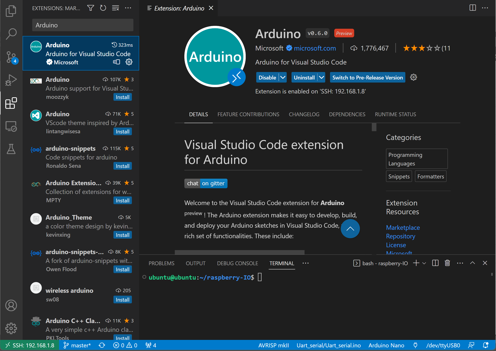
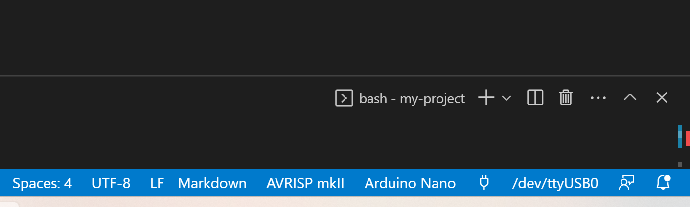

Download the arduino extention in the VS code:

See the detailed tutorial: https://www.youtube.com/watch?v=2BJ-iJF04VA&ab_channel=ArticulatedRobotics

In the bottom right corner choose propriate Serial Port, Board Type configuration and Programmer

Create a folder were the code be implemented in the embedded systems. The `Arduino/Blink/` folder is brovided for the example. To compile the AVR programs use the top right corner buttons.

Note folder and ino file should be the same