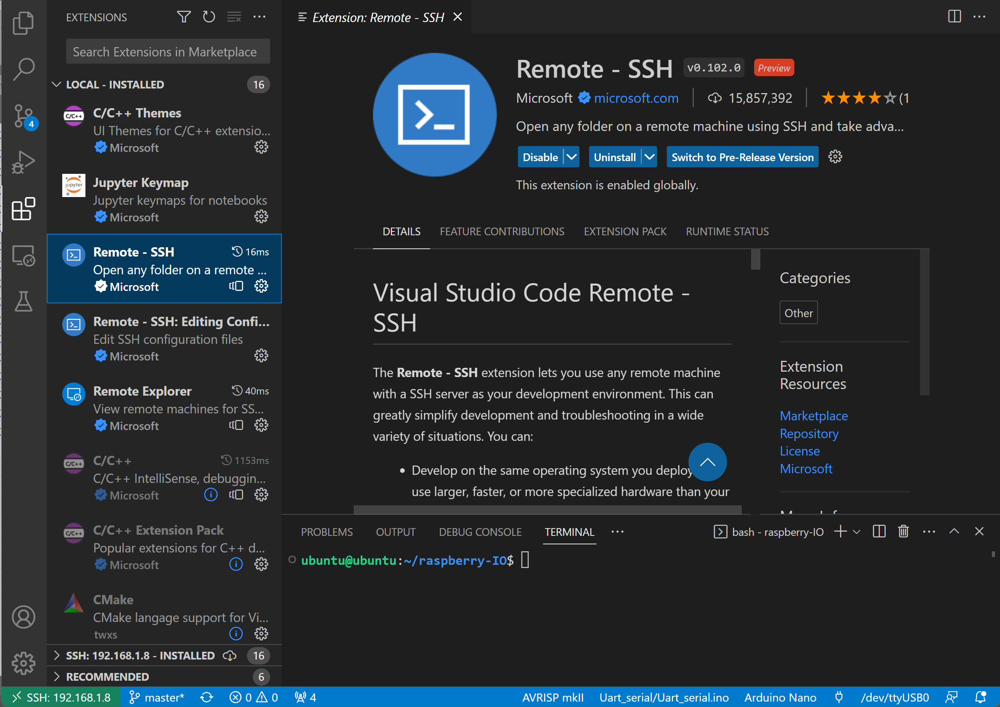
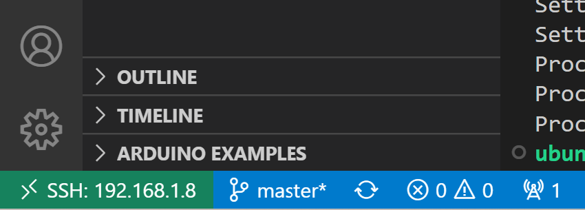
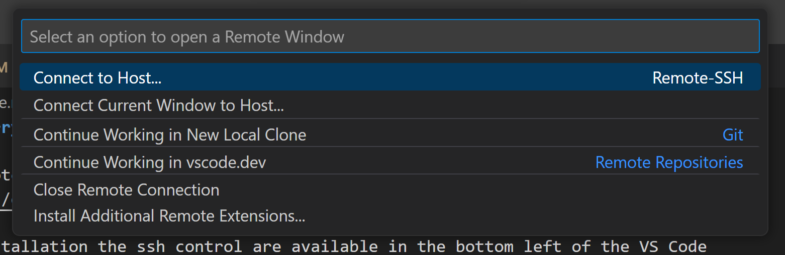

# SSH companion computer control via Visual Studio Code

Install "remote control", "c++" and "python" extentions


After the installations the ssh control are available in the bottom left corner of the VS Code:


Connect to the companion computer HOST for example `ubuntu@192.168.1.8`, type a password and ready to go!


Clone this project:
```bash
mkdir /lowlevel_project
cd /lowlevel_project
git clone https://github.com/TPODAvia/raspberry-IO.git
```

Follow the instructions for the specific microcontrollers family:

[Arduino family](Arduino/README.md)

[STM32 family](STM32/README.md)

Additional, some code are provided for the Raspberry Pi GPIO examples.
